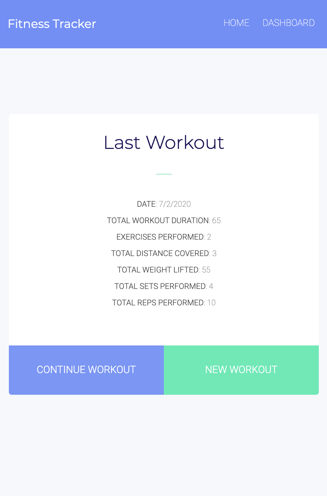
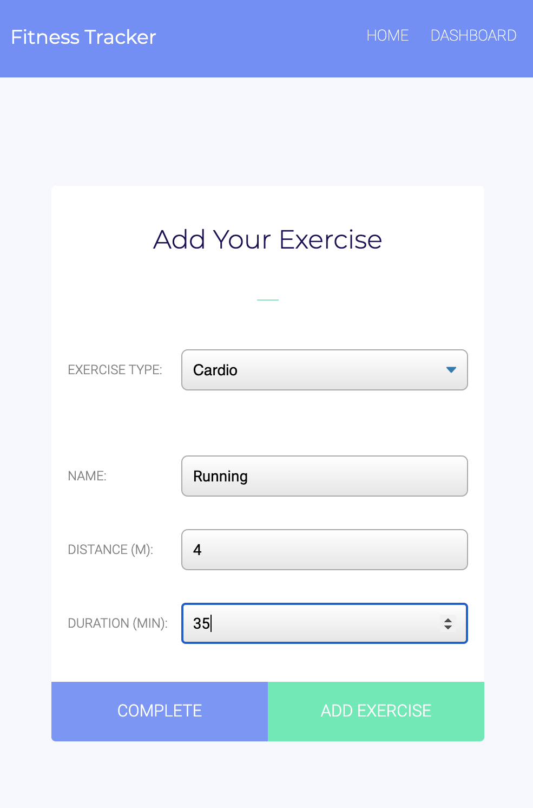
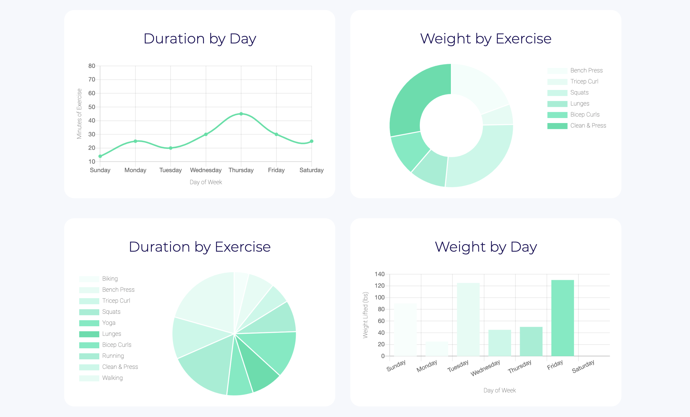

# [Fitness-Tracker](https://jp-fitness-tracker.herokuapp.com/)

## Description

## Table of Contents
* [Technologies](#technologies)
* [Usage](#usage)
* [Finished Product](#finished-product)
* [Directions for Future Development](#Directions-for-future-Development)
* [Credits](#Credits)
* [Questions](#questions)

## Technologies
* HTML
* CSS
* JavaScript
* Node.js
* Express
* MongoDB
* Mongoose
* Chart.js

## Usage
* Navigate to the [deployed Heroku App](https://jp-fitness-tracker.herokuapp.com/).

## Finished Product
View deployed Heroku app [here](https://jp-fitness-tracker.herokuapp.com/).  

<!--  -->

## Directions for Future Development

## Credits

## Questions
